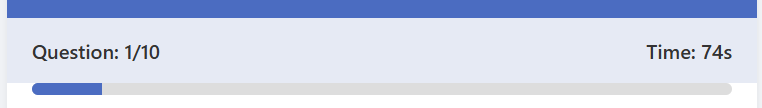
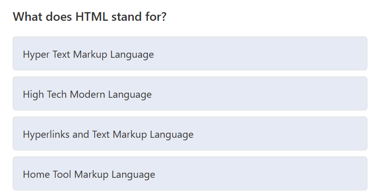
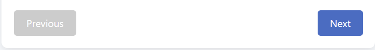
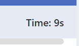
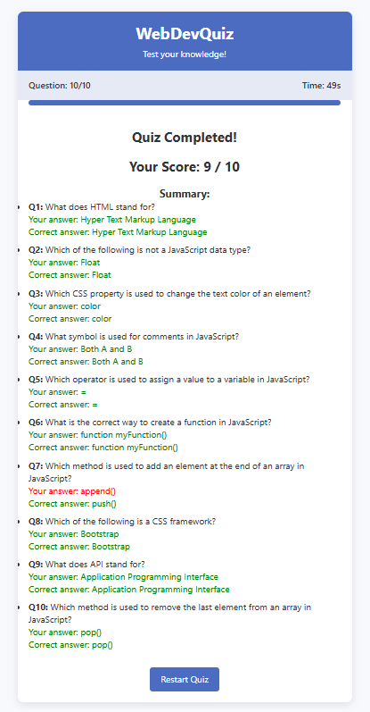
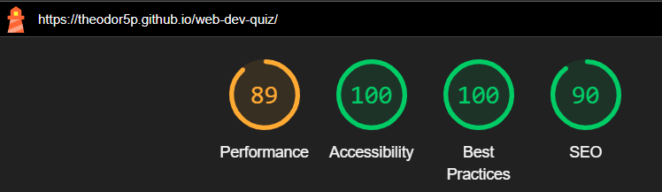

# web-dev-quiz
WebDevQuiz App is an interactive web application designed to test users' knowledge on web development topics. The project aims to provide an engaging and educational experience for those learning or refreshing their knowledge of HTML, CSS, and JavaScript fundamentals. With a clean, responsive interface and immediate feedback on answers, the WebDevQuiz App serves as both a learning tool and a way to assess one's understanding of key web development concepts.

The application features a collection of carefully crafted questions covering various aspects of web development, from basic HTML tags to JavaScript methods and CSS properties. The WebDevQuiz App is fully responsive and works across different devices, making it accessible for users to test their knowledge anywhere.

## Features 

The Quiz App includes several features designed to create an engaging and educational user experience, with functionality that helps users easily navigate through questions and receive immediate feedback on their answers.

### Existing Features

- __Header and Progress Tracking__

  - The app features a clean header that clearly displays the application name, along with progress tracking that shows users which question they're currently on out of the total.
  - A visual progress bar updates as users advance through the quiz, providing a clear indication of their progress.

- __Question Display Area__

  - This central section presents each question clearly with four possible answer options.
  - Users can easily select an answer by clicking on the option, which highlights to show it's been selected.
  - The interface prevents users from proceeding without selecting an answer, ensuring complete responses.

- __Navigation Controls__

  - Intuitive Previous and Next buttons allow users to navigate between questions.
  - Users can review and change answers to previous questions before submitting.
  - The Next button transforms into a Finish button on the final question, clearly indicating the end of the quiz.uiz_app_header.png

- __Timer Function__

  - A built-in timer tracks how long users spend on the quiz, adding a subtle element of challenge.
  - The timer continues throughout the entire quiz, giving users insight into their response speed.

- __Results Summary__

  - Upon completion, users receive a comprehensive results page showing their total score.
  - A detailed breakdown of each question displays the user's answer alongside the correct answer.
  - Color-coding makes it easy to quickly identify correct and incorrect responses.
  - A restart button allows users to take the quiz again to improve their score.

## Deployment

The Quiz App was deployed to GitHub Pages using the following steps:

1. The code was pushed to a GitHub repository
2. From the GitHub repository, navigate to the Settings tab
3. In the left-hand sidebar, select Pages
4. From the source section dropdown, select the main branch
5. Once the main branch is selected, the page is automatically refreshed with a confirmation message displaying the successful deployment

The live link can be found here: [WebDevQuiz App](https://theodor5p.github.io/web-dev-quiz/)

## Testing 

The Quiz App has been thoroughly tested to ensure all features function correctly across different browsers and devices. The testing process included:

- Verifying that all questions display correctly
- Confirming that answer selection functions properly
- Testing navigation between questions works in both directions
- Ensuring the timer counts accurately
- Validating that the score calculation is correct
- Testing the results display for accuracy
- Checking that the restart functionality properly resets the quiz

The application was tested on multiple browsers (Chrome, Firefox, Safari, and Edge) and across different screen sizes to ensure responsive design and consistent functionality.

### Validator Testing 

- HTML
  - No errors were returned when passing through the official [W3C validator](https://validator.w3.org/nu/?doc=https%3A%2F%2Ftheodor5p.github.io%2Fweb-dev-quiz%2F)
- CSS
  - No errors were found when passing through the official [(Jigsaw) validator](https://jigsaw.w3.org/css-validator/validator?uri=https%3A%2F%2Ftheodor5p.github.io%2Fweb-dev-quiz%2F&profile=css3svg&usermedium=all&warning=1&vextwarning=&lang=de)
- Accessibility
  - I confirmed that the colors and fonts chosen are easy to read and accessible by running it through lighthouse in devtools

  

## Credits 

### Content 

- The quiz questions were created based on information from [MDN Web Docs](https://developer.mozilla.org/)
- The design was inspired by modern quiz applications and e-learning platforms

### Media

- The color scheme was generated using [Coolors](https://coolors.co/)

### Code

- The progress bar animation was adapted from [CSS-Tricks](https://css-tricks.com/css3-progress-bars/)
- The timer functionality was inspired by tutorials from [JavaScript.info](https://javascript.info/)
