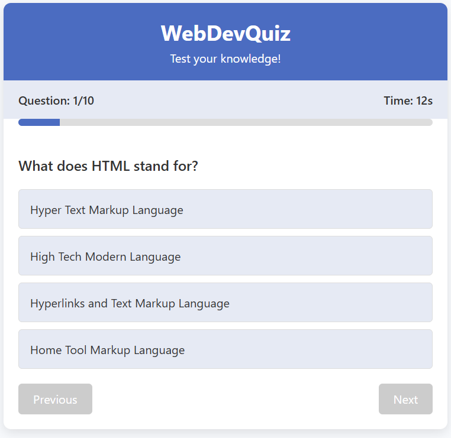

# web-dev-quiz
WebDevQuiz App is an interactive web application designed to test users' knowledge on web development topics. The project aims to provide an engaging and educational experience for those learning or refreshing their knowledge of HTML, CSS, and JavaScript fundamentals. With a clean, responsive interface and immediate feedback on answers, the WebDevQuiz App serves as both a learning tool and a way to assess one's understanding of key web development concepts.

The application features a collection of carefully crafted questions covering various aspects of web development, from basic HTML tags to JavaScript methods and CSS properties. The WebDevQuiz App is fully responsive and works across different devices, making it accessible for users to test their knowledge anywhere.

